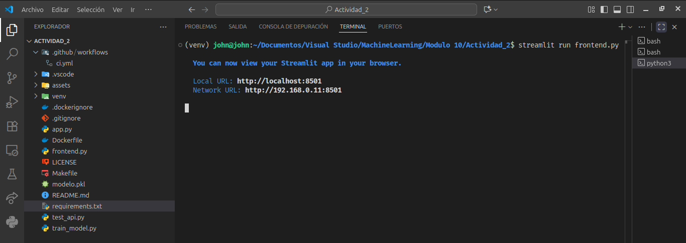

[](https://github.com/eagomezdaza/iris-flask-docker-api/actions/workflows/ci.yml)


---

# 🌸 API de Clasificación Iris con Flask y Docker

Este proyecto implementa una **API REST para la clasificación de flores Iris** utilizando **Flask**, **Docker** y un modelo **Random Forest** entrenado con *scikit-learn*.  
El objetivo es demostrar un flujo completo de *MLOps educativo*: desde el entrenamiento hasta la contenedorización y despliegue con verificación de salud.

Incluye además una **interfaz Streamlit** para pruebas visuales, un **Makefile** para automatizar tareas, y un **pipeline de integración continua (CI)** en GitHub Actions.

---

## 🎯 Objetivo

Desarrollar una API que permita consumir un modelo de clasificación entrenado, incorporando:
- Validación de entradas JSON.
- Manejo de errores.
- Predicciones vía `POST /predict`.
- Verificación de salud (`GET /health`).
- Pruebas automáticas y build Docker reproducible.

El dataset utilizado corresponde al clásico **Iris Dataset** incluido en `sklearn.datasets`.

---

## 🧱 Estructura del Proyecto

```
iris-flask-docker-api/
├── app.py
├── train_model.py
├── test_api.py
├── frontend.py
├── modelo.pkl
├── requirements.txt
├── Dockerfile
├── Makefile
├── LICENSE
├── .dockerignore
├── .gitignore
├── README.md
├── assets/
│   ├── entrenamiento.png
│   ├── api_local.png
│   ├── docker_run.png
│   ├── streamlit_demo.png
│   └── workflow_ci.png
└── .github/
    └── workflows/
        └── ci.yml
```

## Requisitos

- Python 3.9+ (para pruebas locales)
- Docker instalado en el sistema

Instalación de dependencias (si se quiere probar localmente sin Docker):

```bash
python -m venv venv
source venv/bin/activate
pip install -r requirements.txt
```

## Entrenamiento del modelo

Para entrenar y generar el archivo `modelo.pkl`:

```bash
python train_model.py
```

Esto entrena un modelo RandomForestClassifier y guarda el artefacto serializado.

## Ejecución de la API (local)

```bash
python app.py
```

Por defecto se expone en:  
`http://127.0.0.1:5002`

Endpoints disponibles:
- `GET /` → Mensaje de bienvenida y documentación breve  
- `GET /health` → Estado del servicio y metadatos del modelo  
- `POST /predict` (POST) → Predicción a partir de datos JSON

Ejemplo de petición:

```bash
curl -X POST http://127.0.0.1:5002/predict   -H "Content-Type: application/json"   -d '{"features":[5.1, 3.5, 1.4, 0.2]}'
```

## Frontend con Streamlit

El archivo `frontend.py` permite interactuar de forma visual con la API.

Ejecutar:

```bash
streamlit run frontend.py
```

Esto abrirá un navegador en `http://localhost:8501` donde podrás enviar peticiones a la API (`http://127.0.0.1:5002`).

## Pruebas automáticas

Ejecuta las pruebas con:

```bash
python test_api.py --base-url http://127.0.0.1:5002
```

Valida los endpoints `/`, `/health` y `/predict` con casos válidos e inválidos.

## Contenerización con Docker

1. Construir la imagen:

```bash
docker build -t ml-api-act2 .
```

2. Ejecutar el contenedor mapeando el puerto 5002:

```bash
docker run -d --name mlapi2 -p 5002:5002 ml-api-act2
```

3. Validar su funcionamiento con `curl`, Postman o el frontend:

```bash
curl -X POST http://127.0.0.1:5002/predict   -H "Content-Type: application/json"   -d '{"features":[6.0, 2.5, 5.0, 1.5]}'
```

## 🧪 Resultados y Evidencias

A continuación, se muestran algunas capturas del funcionamiento del sistema:

| Etapa | Descripción | Captura |
|-------|--------------|---------|
| Entrenamiento del modelo | Ejecución del script `train_model.py` generando `modelo.pkl` |  |
| Prueba local de la API | Verificación de `/health` y `/predict` con `curl` |  |
| Contenedor Docker en ejecución | Imagen construida y contenedor saludable (`HEALTHY`) |  |
| Interfaz Streamlit | Predicción visual en el frontend local |  |
| Interfaz Streamlit (segunda vista) | Vista adicional del resultado |  |

## 🎨 Interfaz visual con Streamlit

Para facilitar la interacción con la API y realizar pruebas de predicción de forma amigable, se implementó un **frontend con Streamlit**.


### Ejecución local
Con el entorno virtual activo (`venv`), ejecutar:

```bash
streamlit run frontend.py
```
Esto abrirá automáticamente la aplicación en tu navegador en:

http://localhost:8501/

La interfaz permite ingresar las cuatro características de la flor Iris, enviar la solicitud a la API Flask en localhost:5002, y visualizar la predicción junto con las probabilidades.


## Notas finales

- El modelo cargado por defecto es modelo.pkl.
- El puerto base de ejecución es 5002.
- Este proyecto puede extenderse fácilmente a otros datasets o modelos.
- Se recomienda incluir un flujo CI/CD con GitHub Actions para automatizar pruebas y despliegue.
- No se deben versionar carpetas de entorno virtual (venv/) ni archivos temporales (__pycache__/, .pyc), ya que están contemplados en .gitignore.


## 🧾 Licencia

Este proyecto se distribuye bajo la licencia MIT.
Consulta el archivo LICENSE para más información.
