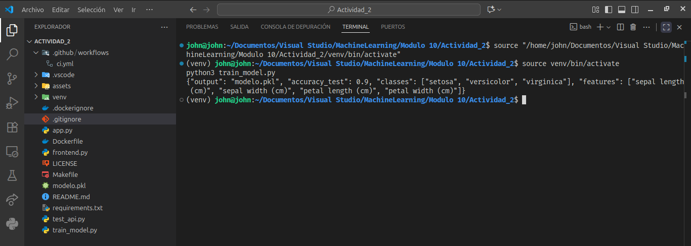
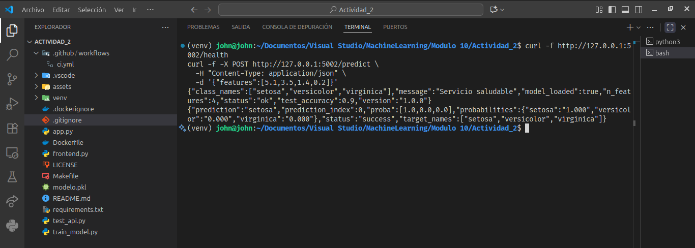
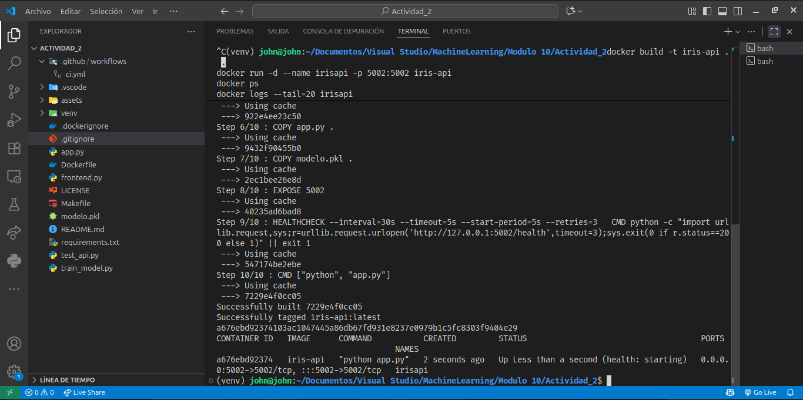
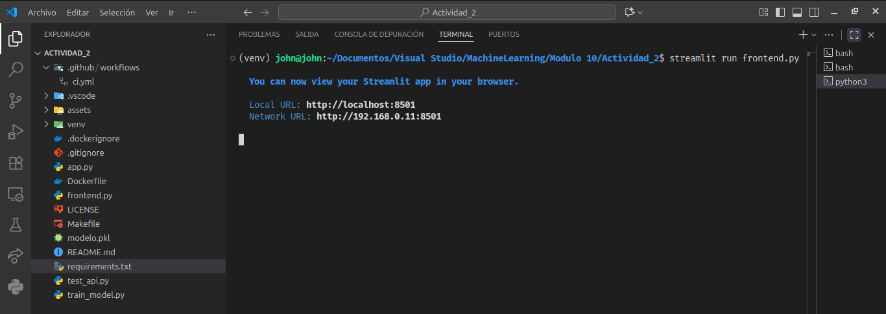

# 🌸 Iris Flask Docker API

Proyecto demostrativo de despliegue de un modelo de Machine Learning con Flask y Docker.  
Incluye entrenamiento, API REST, contenedor Docker, Streamlit frontend y pipeline CI/CD con GitHub Actions.

## 🔍 Endpoints de la API
- **GET /** → Documentación breve  
- **GET /health** → Estado y metadatos del modelo  
- **POST /predict** → Clasificación de una flor Iris  

## 📷 Evidencias

---

> Autor: **John Gómez**  
> Repositorio: [iris-flask-docker-api](https://github.com/eagomezdaza/iris-flask-docker-api)
